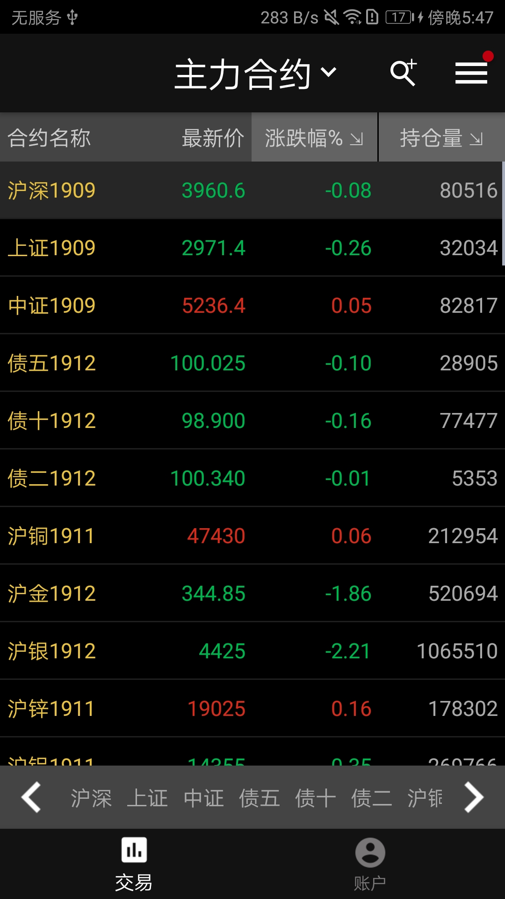
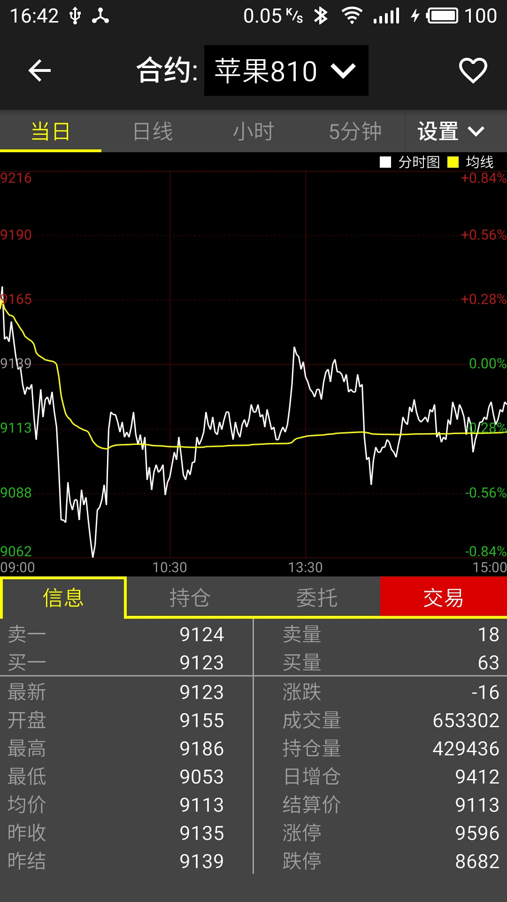
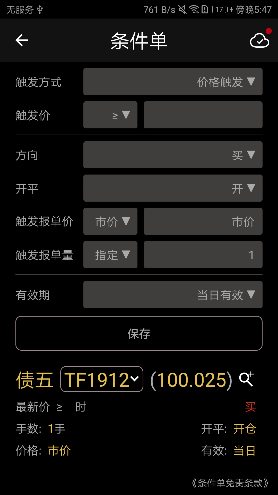

# shinny-futures-android
一个开源的 android 平台期货行情交易终端 
### Preview
   
### Install
*快速点亮:* 您可以点击代码仓库的`Release`标签，安装相应版本的apk文件至手机端，Android系统最低要求是`4.4` 
当然，您也可以下载导入`Android Studio`中运行安装，下面着重介绍一下开发配置：
- Android Studio版本：3.2.1
- Gradle版本：4.4
- JDK：使用AS内置jre
- bugly：项目中嵌入了bugly平台的升级和热更新模块，具体使用见[bugly文档中心](https://bugly.qq.com/docs/)
- 期货公司版本：在模块的build.gradle文件中包含多个期货公司版本，您可以在AS的`Build Variant`中选择`kuaiqixiaoq`全期货公司版本进行模拟测试
- 模拟账号：可以到simnow官网注册([simnow账号注册](http://www.simnow.com.cn/))，然后在登陆页期货公司选择`S上期技术`
- 提问：您可以在`issue`中给我们留言，也可以加入QQ群`611806823`交流讨论
### Function
软件的主要功能：查看行情以及进行交易 
- 首页
 - 导航栏：完成各个交易所合约列表的切换以及不同页面的跳转
 - 合约列表显示：合约报价单显示，长按添加/删除自选
 - 账户：查看账户资金
 - 持仓：跳转到合约详情页
 - 成交：查看成交记录
 - 转账：进行银期转帐
 - 反馈：用户意见查看与反馈
 - 搜索：合约搜索
- 合约详情页
 - 当日：显示分时图
 - K线：查看不同周期Ｋ线
 - 附图：附图指标
 - 信息：显示合约盘口信息
 - 持仓：显示账户持仓列表
 - 委托：显示账户下单情况
 - 交易：三键下单板进行交易
- 云条件单页
 - 价格触发
 - 区间触发
 - 开盘抢单
 - 时间触发
- 止盈止损页
 - 价格触发
 - 时间触发

### Code Architecture
#### Data
根据websocket协议进行实时数据更新
- 利用OkHttp从服务器获取合约列表文件进行解析
- 利用java-websocket框架分别与行情和交易服务器进行连接，获取行情数据和期货公司列表数据
- 对服务器发过来的json数据进行解析
- 数据解析完毕后利用android广播机制进行行情数据以及交易数据的刷新
#### UI
界面由activity、fragment以及adapter三个模块构成，分别负责作为容器、数据展示与交互以及数据绑定刷新
- 利用Support Library库中的RecyclerView实现合约报价列表、Drawlayout实现抽屉导航
- 利用MPAndroidChart框架完成Ｋ线图的绘制
- 利用dataBinding框架部分页面数据的绑定，简化代码
- 自定义下单软键盘
#### Framework
- [Gson](https://github.com/google/gson)
- [EventBus](https://github.com/greenrobot/EventBus)
- [Okhttp](https://github.com/square/okhttp)
- [nv-websocket-client](https://github.com/TakahikoKawasaki/nv-websocket-client)
- [MPAndroidChart](https://github.com/PhilJay/MPAndroidChart)
